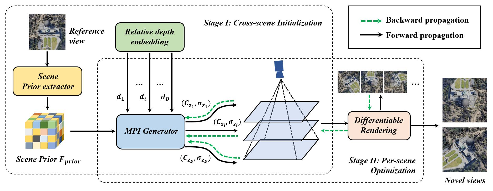
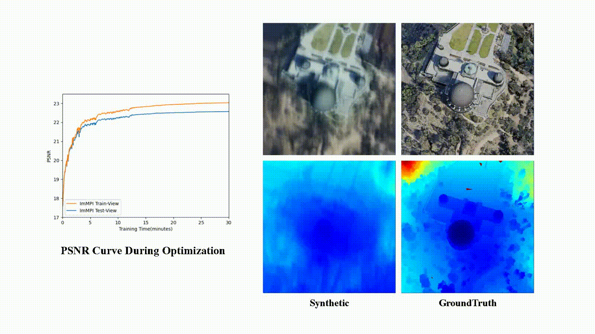

# ImMPI
Official Pytorch implementation of the preprint paper "Remote Sensing Novel View Synthesis with Implicit Multiplane Representations"

## Introduction
Novel view synthesis of remote sensing scenes is of great significance for scene visualization, human-computer interaction, and various downstream applications. Despite the recent advances in computer graphics and photogrammetry technology, generating novel views is still challenging particularly for remote sensing images due to its high complexity, view sparsity and limited view-perspective variations. In this paper, we propose a novel remote sensing view synthesis method by leveraging the recent advances in implicit neural representations. Considering the overhead and far depth imaging of remote sensing images, we represent the 3D space by combining implicit multiplane images (MPI) representation and deep neural networks. The 3D scene is reconstructed under a self-supervised optimization paradigm through a differentiable multiplane renderer with multi-view input constraints. Images from any novel views thus can be freely rendered on the basis of the reconstructed model. As a by-product, the depth maps corresponding to the given viewpoint can be generated along with the rendering output. We refer to our method as Implicit Multiplane Images ImMPI. To further improve the view synthesis under sparse-view inputs, we explore the learning-based initialization of remote sensing 3D scenes and proposed a neural network based Prior extractor to accelerate the optimization process. In addition, we propose a new dataset for remote sensing novel view synthesis with multi-view real-world google earth images. Extensive experiments demonstrate the superiority of the ImMPI over previous state-of-the-art methods in terms of reconstruction accuracy, visual fidelity, and time efficiency. Ablation experiments also suggest the effectiveness of our methodology design.

Visualization of some samples are shown here.


## Installation
```bash
git clone git@github.com:wyc-Chang/ImMPI.git
cd ImMPI
pip install -r requirement.txt
```

## Reproducing Results
1. Download the [LEVIR-NVS](https://drive.google.com/drive/folders/1orEpAN-SLF0i7yFn_mrPVmtM12E2pcdj?usp=sharing) dataset, which contains 16 scenes. The whole dataset is organized as follows:
```
root_directory
├──view_split.txt 
├──scene_000
├──scene_001
      ├── Images                 
      │   ├── 000.png       
      │   ├── 001.png       
      │   └── ...                
      ├── Cams                   
      │   ├── 000.txt   
      │   ├── 001.txt   
      │   └── ...                
      └── Depths  
      │   ├── 000.tiff   
      │   ├── 001.tiff   
      │   └── ...     
      └── Track  
          ├── 000.txt   
          ├── 001.txt   
          └── ...    
```
   * Camera file in ``Cams`` directory stores the camera parameters, which includes intrinsic, extrinsic and depth range:
```
extrinsic
E00 E01 E02 E03
E10 E11 E12 E13
E20 E21 E22 E23
E30 E31 E32 E33

intrinsic
K00 K01 K02
K10 K11 K12
K20 K21 K22

DEPTH_MIN DEPTH_MAX 
```

  * ``Track`` directory stores a camera track for rendering a video, containing 100 novel viewpoints.

  * ``view_split.txt`` declares the split of Train-View and Test-View for all scenes.
```
ViewNum                       # train view number
ID0 ID1 ID2 ...               # index of Train-View ID for all scenes in dataset 
ViewNum                       # train view number
ID0 ID1 ID2 ...               # index of Train-View ID for all scenes in dataset 
...
``` 
  * ``Depths`` directory stores depth maps of cooresponding views, the ``.tiff`` file can be read by:
```bash
depth = np.array(Image.open(filename)).astype(np.float32)
```

2. Download the pretrained weights from [Google Drive](https://drive.google.com/drive/folders/1l1z6tBtSiIl39ASyoO_2kDYmNxLYWmp1?usp=sharing), and unzip into the repo directory. The checkpoints directory should be organized as follows:
```
checkpoints
├──ASI_prior.ckpt
├──optimization
      ├── scene_000_000              
      │   ├── optimizedImMPI.ckpt                    
      ├── scene_001_000                   
          ├── optimizedImMPI.ckpt                
      ...  
```
 * Optimized models for each scene are stored in ``optimization`` directory.

3.  Render views from optimized ImMPI of each scene. Run the following command to render image from implicit multiplane representation. Make sure you have the right value for variable ``dataset_dirpath`` in ``renderImages.py``. You can find the result in ``output/syntheticImage/Levir_NVS`` directory.
```bash
python example_render_image.py
```

4. Render video according to the camera track supplied. Run the following command to generate video in ``output/track_video`` for ``scene_000``:
```bash
python example_render_video.py –-config=configs/renderTrack/scene_000.txt
```

### Training
  Our algorithm consists of 1) Cross-scene Initialization and 2) Per-scene Optimization. The former is learning-based method training based on remote sensing Multi-View Stereo dataset. We reorganize [WHU MVS/Stereo dataset](https://drive.google.com/drive/folders/1-4BpcJ4cyLSf0lxafkKBkx3eSW3UppVg?usp=sharing) for prior extractor training.
  Train the model by running:
```bash
python train.py --config/configs/pretrain/whu_mvs.txt
```
  The following we give the config file of how the parameters are defined.
```
# dataset parameters
dataset = whu_mvs
train_dataset_dirpath = dataset_dirpath
train_list_filepath = ./datasets/datalist/whu_mvs/train.txt
validate_dataset_dirpath = dataset_dirpath
validate_list_filepath = ./datasets/datalist/whu_mvs/val.txt

# training parameters
epochs = 500
learning_rate = 0.0001
lr_ds_epoch_idx = 100,200,300,400:2
batch_size = 1
num_workers = 8
logdir = "./checkpoints/ASI_training"
#resume = False
loadckpt = None

# log writer and random seed parameters
summary_scalars_freq = 100
summary_images_freq = 500
save_ckpt_freq = 50
validate_freq = 20
seed = 28

# model parameters
depth_sample_num = 32
feature_generator_model_type = "resnet18"
neighbor_view_num = 19

# loss weights
loss_rgb_weight = 2.0
loss_ssim_weight = 1.0
```

### Optimization
  With pretrained Across Scene Initialization model, optimization for ``scene_000`` is implemented by running following command. In addition, we supply a pretrained ASI-model in ``checkpoint/ASI_prior.ckpt``.
```bash
python optimize.py --config/configs/optimization/levir_nvs/scene_000.txt
```

## Visualization
* Visualization of rendered novel view images for scenes in Levir-NVS. We supply the camera track for each scene in dataset.


* Visualization of ImMPI layers. We visualized image, depth map and RGB and sigma values of MPI layers corresponding to novel view.

&emsp;&emsp; From the figure, it can be seen that ground objects such as buildings and trees of different heights in the same scene appear in different MPI layers. As the depth increases (away from the camera), the content in the scene from the roof to the ground gradually emerges.


* Optimization process of Scene``#Observation``. Rendered RGB image and depth corresponding to one of the Test-View are shown as follows. "w/o CSI" refers to optimization without Cross-scene Initialization. 


## Citation
If you use this code for your research, please cite our paper:

``````
@ARTICLE{9852475,
author={Wu, Yongchang and Zou, Zhengxia and Shi, Zhenwei},
journal={IEEE Transactions on Geoscience and Remote Sensing},
title={Remote Sensing Novel View Synthesis With Implicit Multiplane Representations},
year={2022},
volume={60},
number={},
pages={1-13},
doi={10.1109/TGRS.2022.3197409}}
``````

